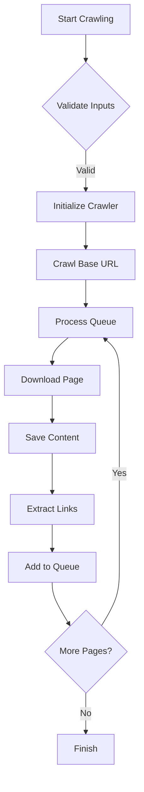

A **Python-based web scraping and crawling tool** with a **graphical user interface (GUI)** built using `tkinter`. This tool allows users to crawl websites, download pages, and save them locally while maintaining the directory structure. It’s designed for ease of use, with features like depth control, rate limiting, and real-time logging.

---

## Features

- **Intuitive GUI**: Built with `tkinter` for a user-friendly experience.
- **Depth Control**: Set the maximum depth for crawling to control how far the crawler goes.
- **Local Saving**: Downloads and saves web pages locally, rewriting links for offline use.
- **Rate Limiting**: Configurable delay between requests to avoid overwhelming servers.
- **Stop Functionality**: Stop the crawling process at any time with a single click.
- **Real-Time Logging**: Monitor the crawling process with live updates in the GUI.

---

## How It Works

### Crawling Algorithm
The crawler uses a **breadth-first search (BFS) algorithm** with depth control:
1. Starts with the base URL at depth 0.
2. Processes pages in FIFO order.
3. Discovers new links up to the specified maximum depth.
4. Maintains a set of visited URLs to avoid duplicates.

### URL Validation
The tool includes special handling for Wikipedia and other sites:
```python
def is_valid_url(self, url):
    # Skip images and non-HTML files
    # Special rules for Wikipedia URLs
    # Standard validation for other domains
```

### Link Rewriting
Localizes links using relative paths for offline use:
```python
local_path = self.clean_filename(absolute_url)
relative_path = os.path.relpath(local_path, os.path.dirname(filename))
anchor['href'] = relative_path
```

### Threading for Responsive GUI
The crawling process runs in a separate thread to keep the GUI responsive:
```python
threading.Thread(target=crawl_thread, daemon=True).start()
```

---

## Full Code

Github Repository:  [Web Scraper Tool](https://github.com/Diogo-Lages/Web_Scraper.py)


```python
import tkinter as tk
from tkinter import ttk, filedialog, messagebox
import threading
import sys
import os
import requests
from bs4 import BeautifulSoup
from urllib.parse import urljoin, urlparse
import time
import re


class WebsiteCrawler:
    def __init__(self, base_url, output_dir="downloaded_site", max_depth=3):
        self.base_url = base_url
        self.domain = urlparse(base_url).netloc
        self.output_dir = output_dir
        self.visited_urls = set()
        self.rate_limit = 1  # Delay between requests in seconds
        self.max_depth = max_depth
        self.stop_requested = False  # Flag to control crawling

        # Create output directory if it doesn't exist
        if not os.path.exists(output_dir):
            os.makedirs(output_dir)

    def stop(self):
        """Request the crawler to stop after current page"""
        self.stop_requested = True
        print("\nStop requested. Finishing current page...")

    def is_valid_url(self, url):
        """Check if URL belongs to the same domain and is a webpage."""
        try:
            parsed = urlparse(url)

            # Skip any image files
            image_extensions = ('.jpg', '.jpeg', '.png', '.gif', '.svg', '.webp', '.bmp', '.ico')
            if url.lower().endswith(image_extensions):
                print(f"Skipping image file: {url}")
                return False

            # Skip Wikipedia special pages and non-article pages
            skip_patterns = [
                '/wiki/Wikipedia:',
                '/wiki/File:',
                '/wiki/Help:',
                '/wiki/Special:',
                '/wiki/Talk:',
                '/wiki/User:',
                '/wiki/Template:',
                '/wiki/Category:',
                '/wiki/Portal:',
                'action=',
                'oldid=',
                'diff=',
                'printable=',
                'mobileaction='
            ]

            # Check if this is a Wikipedia URL and if so, apply special rules
            if 'wikipedia.org' in parsed.netloc:
                # Skip special pages but allow all regular article pages
                if any(pattern in url for pattern in skip_patterns):
                    print(f"Skipping Wikipedia special page: {url}")
                    return False

                # Make sure it's a wiki article page
                if not '/wiki/' in url:
                    print(f"Skipping non-article page: {url}")
                    return False

                # Allow all regular Wikipedia articles
                if '/wiki/' in url and parsed.netloc == self.domain:
                    return True

            # For non-Wikipedia sites, use standard validation
            is_valid = (
                    parsed.netloc == self.domain and
                    parsed.scheme in ['http', 'https'] and
                    not url.endswith(('.pdf', '.zip', '.doc', '.docx'))
            )

            if not is_valid:
                print(f"URL rejected: {url}")

            return is_valid

        except Exception as e:
            print(f"Error parsing URL {url}: {str(e)}")
            return False

    def clean_filename(self, url):
        """Convert URL to a valid filename."""
        # Remove the domain and scheme
        filename = urlparse(url).path
        if not filename or filename.endswith('/'):
            filename += 'index.html'
        elif not filename.endswith('.html'):
            filename += '.html'

        # Clean the filename
        filename = re.sub(r'[<>:"/\\|?*]', '_', filename)
        return filename.lstrip('/')

    def download_page(self, url):
        """Download a webpage and return its content."""
        try:
            headers = {
                'User-Agent': 'Mozilla/5.0 (Windows NT 10.0; Win64; x64) AppleWebKit/537.36 (KHTML, like Gecko) Chrome/91.0.4472.124 Safari/537.36'
            }
            print(f"\nAttempting to download: {url}")
            response = requests.get(url, timeout=10, headers=headers)
            response.raise_for_status()
            print(f"Download successful! Status code: {response.status_code}")
            print(f"Content length: {len(response.text)} characters")
            return response.text
        except requests.exceptions.RequestException as e:
            print(f"Error downloading {url}: {str(e)}")
            return None

    def save_page(self, content, url):
        """Save webpage content to a file and rewrite links to point to local files."""
        if content:
            filename = self.clean_filename(url)
            filepath = os.path.join(self.output_dir, filename)

            print(f"\nSaving page to: {filepath}")

            try:
                # Parse the HTML
                soup = BeautifulSoup(content, 'html.parser')

                # Remove all image elements
                for img in soup.find_all('img'):
                    img.decompose()

                # Remove all picture elements
                for picture in soup.find_all('picture'):
                    picture.decompose()

                # Remove image-related elements like figure/figcaption if they're empty after image removal
                for figure in soup.find_all('figure'):
                    if not figure.find(string=True, recursive=False):
                        figure.decompose()

                # Rewrite links to point to local files
                for anchor in soup.find_all('a', href=True):
                    href = anchor['href']
                    absolute_url = urljoin(url, href)

                    if absolute_url in self.visited_urls:
                        # Convert the absolute URL to a local path
                        local_path = self.clean_filename(absolute_url)
                        # Make the path relative to the current file
                        current_depth = len(os.path.dirname(filename).split(os.sep))
                        relative_path = os.path.relpath(local_path, os.path.dirname(filename))
                        anchor['href'] = relative_path
                        print(f"Rewriting link: {href} -> {relative_path}")

                # Create subdirectories if needed
                os.makedirs(os.path.dirname(filepath), exist_ok=True)
                print(f"Directory structure created/verified")

                # Save the modified HTML
                with open(filepath, 'w', encoding='utf-8') as f:
                    f.write(str(soup))
                print(f"Successfully saved modified HTML to {filename}")

            except Exception as e:
                print(f"Error saving {filename}: {str(e)}")
                print(f"Full path attempted: {os.path.abspath(filepath)}")

    def extract_links(self, content, url):
        """Extract all valid links from a webpage."""
        soup = BeautifulSoup(content, 'html.parser')
        links = set()

        print(f"\nExtracting links from {url}")
        link_count = 0

        for anchor in soup.find_all('a', href=True):
            link = urljoin(url, anchor['href'])
            if self.is_valid_url(link):
                links.add(link)
                link_count += 1

        print(f"Found {link_count} valid links on this page")
        return links

    def crawl(self):
        """Start the crawling process."""
        # Reset stop flag
        self.stop_requested = False

        # Queue now contains tuples of (url, depth)
        queue = [(self.base_url, 0)]
        pages_processed = 0
        start_time = time.time()

        print(f"\nStarting crawl of {self.base_url}")
        print(f"Maximum depth: {self.max_depth}")

        while queue and not self.stop_requested:
            url, depth = queue.pop(0)

            if url in self.visited_urls or depth >= self.max_depth:
                continue

            pages_processed += 1
            print(f"\n--- Processing page {pages_processed} ---")
            print(f"URL: {url}")
            print(f"Depth: {depth}/{self.max_depth}")
            print(f"Queue size: {len(queue)}")

            self.visited_urls.add(url)

            # Download the page
            content = self.download_page(url)
            if content:
                # Save the page
                self.save_page(content, url)

                # Only add new links if we haven't reached max_depth
                if depth < self.max_depth - 1:
                    # Extract and add new links to the queue with incremented depth
                    new_links = self.extract_links(content, url)
                    queue.extend([(link, depth + 1) for link in new_links if link not in self.visited_urls])

                # Rate limiting
                if queue and not self.stop_requested:
                    print(f"Waiting {self.rate_limit} seconds before next page...")
                    time.sleep(self.rate_limit)

        elapsed_time = time.time() - start_time
        print(f"\nCrawling completed!")
        if self.stop_requested:
            print("Crawling was stopped by user")
        print(f"Total pages processed: {pages_processed}")
        print(f"Total unique URLs visited: {len(self.visited_urls)}")
        print(f"Total time: {elapsed_time:.2f} seconds")


class WebCrawlerGUI:
    def __init__(self, root):
        self.root = root
        self.root.title("Web Crawler")
        self.root.geometry("600x500")
        self.crawler = None  # Initialize crawler reference

        # Create main frame
        main_frame = ttk.Frame(root, padding="10")
        main_frame.grid(row=0, column=0, sticky=(tk.W, tk.E, tk.N, tk.S))

        # URL input
        ttk.Label(main_frame, text="URL to crawl:").grid(row=0, column=0, sticky=tk.W, pady=5)
        self.url_var = tk.StringVar()
        self.url_entry = ttk.Entry(main_frame, textvariable=self.url_var, width=50)
        self.url_entry.grid(row=0, column=1, columnspan=2, sticky=(tk.W, tk.E), pady=5)

        # Output directory
        ttk.Label(main_frame, text="Output directory:").grid(row=1, column=0, sticky=tk.W, pady=5)
        self.output_var = tk.StringVar(value=os.path.join(os.getcwd(), "downloaded_site"))
        self.output_entry = ttk.Entry(main_frame, textvariable=self.output_var, width=50)
        self.output_entry.grid(row=1, column=1, sticky=(tk.W, tk.E), pady=5)
        ttk.Button(main_frame, text="Browse", command=self.browse_output).grid(row=1, column=2, sticky=tk.W, pady=5,
                                                                               padx=5)

        # Depth input
        ttk.Label(main_frame, text="Maximum depth:").grid(row=2, column=0, sticky=tk.W, pady=5)
        self.depth_var = tk.StringVar(value="3")
        depth_entry = ttk.Entry(main_frame, textvariable=self.depth_var, width=10)
        depth_entry.grid(row=2, column=1, sticky=tk.W, pady=5)

        # Progress frame
        progress_frame = ttk.LabelFrame(main_frame, text="Progress", padding="5")
        progress_frame.grid(row=3, column=0, columnspan=3, sticky=(tk.W, tk.E), pady=10)

        # Progress bar
        self.progress_var = tk.StringVar(value="Ready")
        ttk.Label(progress_frame, textvariable=self.progress_var).grid(row=0, column=0, sticky=tk.W)

        # Log text area
        self.log_text = tk.Text(main_frame, height=15, width=60, wrap=tk.WORD)
        self.log_text.grid(row=4, column=0, columnspan=3, sticky=(tk.W, tk.E), pady=5)

        # Scrollbar for log
        scrollbar = ttk.Scrollbar(main_frame, orient=tk.VERTICAL, command=self.log_text.yview)
        scrollbar.grid(row=4, column=3, sticky=(tk.N, tk.S))
        self.log_text.configure(yscrollcommand=scrollbar.set)

        # Buttons frame
        button_frame = ttk.Frame(main_frame)
        button_frame.grid(row=5, column=0, columnspan=3, pady=10)

        # Start button
        self.start_button = ttk.Button(button_frame, text="Start Crawling", command=self.start_crawling)
        self.start_button.pack(side=tk.LEFT, padx=5)

        # Stop button (initially disabled)
        self.stop_button = ttk.Button(button_frame, text="Stop", command=self.stop_crawling, state='disabled')
        self.stop_button.pack(side=tk.LEFT, padx=5)

        # Configure grid weights
        main_frame.columnconfigure(1, weight=1)

        # Redirect stdout to our log
        sys.stdout = self

    def write(self, text):
        """Handle stdout redirection"""
        self.log_text.insert(tk.END, text)
        self.log_text.see(tk.END)
        self.root.update_idletasks()

    def flush(self):
        """Required for stdout redirection"""
        pass

    def browse_output(self):
        """Open directory browser"""
        directory = filedialog.askdirectory(initialdir=self.output_var.get())
        if directory:
            self.output_var.set(directory)

    def stop_crawling(self):
        """Stop the crawling process"""
        self.stop_button.configure(state='disabled')
        self.progress_var.set("Stopping...")
        self.crawler.stop()  # Request the crawler to stop

    def start_crawling(self):
        """Start the crawling process"""
        # Validate inputs
        url = self.url_var.get().strip()
        output_dir = self.output_var.get().strip()

        try:
            depth = int(self.depth_var.get())
            if depth < 1:
                raise ValueError("Depth must be at least 1")
        except ValueError as e:
            messagebox.showerror("Error", "Invalid depth value. Please enter a positive number.")
            return

        if not url:
            messagebox.showerror("Error", "Please enter a URL")
            return

        if not url.startswith(('http://', 'https://')):
            messagebox.showerror("Error", "URL must start with http:// or https://")
            return

        # Disable inputs while crawling
        self.start_button.configure(state='disabled')
        self.url_entry.configure(state='disabled')
        self.output_entry.configure(state='disabled')
        self.progress_var.set("Crawling...")

        # Clear log
        self.log_text.delete(1.0, tk.END)

        # Start crawling in a separate thread
        def crawl_thread():
            try:
                self.crawler = WebsiteCrawler(url, output_dir, depth)
                self.stop_button.configure(state='normal')  # Enable stop button
                self.crawler.crawl()
                if self.crawler.stop_requested:
                    self.root.after(0, self.crawling_finished, True, "Crawling stopped by user")
                else:
                    self.root.after(0, self.crawling_finished, True)
            except Exception as e:
                self.root.after(0, self.crawling_finished, False, str(e))

        threading.Thread(target=crawl_thread, daemon=True).start()

    def crawling_finished(self, success, error_message=None):
        """Called when crawling is complete"""
        # Re-enable inputs
        self.start_button.configure(state='normal')
        self.url_entry.configure(state='normal')
        self.output_entry.configure(state='normal')

        # Disable stop button
        self.stop_button.configure(state='disabled')

        if success:
            if error_message and "stopped by user" in error_message:
                self.progress_var.set("Crawling stopped")
                messagebox.showinfo("Stopped", "Website crawling was stopped by user")
            else:
                self.progress_var.set("Crawling completed!")
                messagebox.showinfo("Success", "Website crawling completed successfully!")
        else:
            self.progress_var.set("Error occurred!")
            messagebox.showerror("Error", f"An error occurred while crawling:\n{error_message}")


def main():
    root = tk.Tk()
    app = WebCrawlerGUI(root)
    root.mainloop()


if __name__ == "__main__":
    main()
```

---

## Code Structure

### Key Components
1. **`WebsiteCrawler` Class**: Handles the core crawling logic, including URL validation, content downloading, and link extraction.
2. **`WebCrawlerGUI` Class**: Manages the GUI components and threading for a responsive interface.
3. **Main Function**: Initializes the GUI and starts the application.

### Method Overview


---

## Output


---

## Limitations

1. **JavaScript Content**: Cannot render or scrape JavaScript-generated content.
2. **Dynamic Websites**: May miss content loaded asynchronously.
3. **Authentication**: Doesn't handle password-protected pages.
4. **Robots.txt**: Doesn't respect website's `robots.txt` policies.
5. **Large Sites**: Not optimized for very large websites (>1000 pages).

---

## Future Enhancements

- [ ] Add support for `sitemap.xml` parsing.
- [ ] Implement concurrent requests with thread pooling.
- [ ] Add CSS/JavaScript file downloading.
- [ ] Create sitemap visualization.
- [ ] Add proxy support for distributed crawling.
- [ ] Respect `robots.txt` rules.
- [ ] Add support for handling cookies and sessions.
- [ ] Implement a retry mechanism for failed requests.

---

## Ethical Considerations

- Always check the website's **Terms of Service** before scraping.
- Add `robots.txt` checking (currently not implemented).
- Implement rate limiting to avoid server overload.
- Consider adding `Referrer-Policy` and `User-Agent` headers.
- Never scrape personal or sensitive information.
- Use the tool responsibly and for educational purposes only.

---


